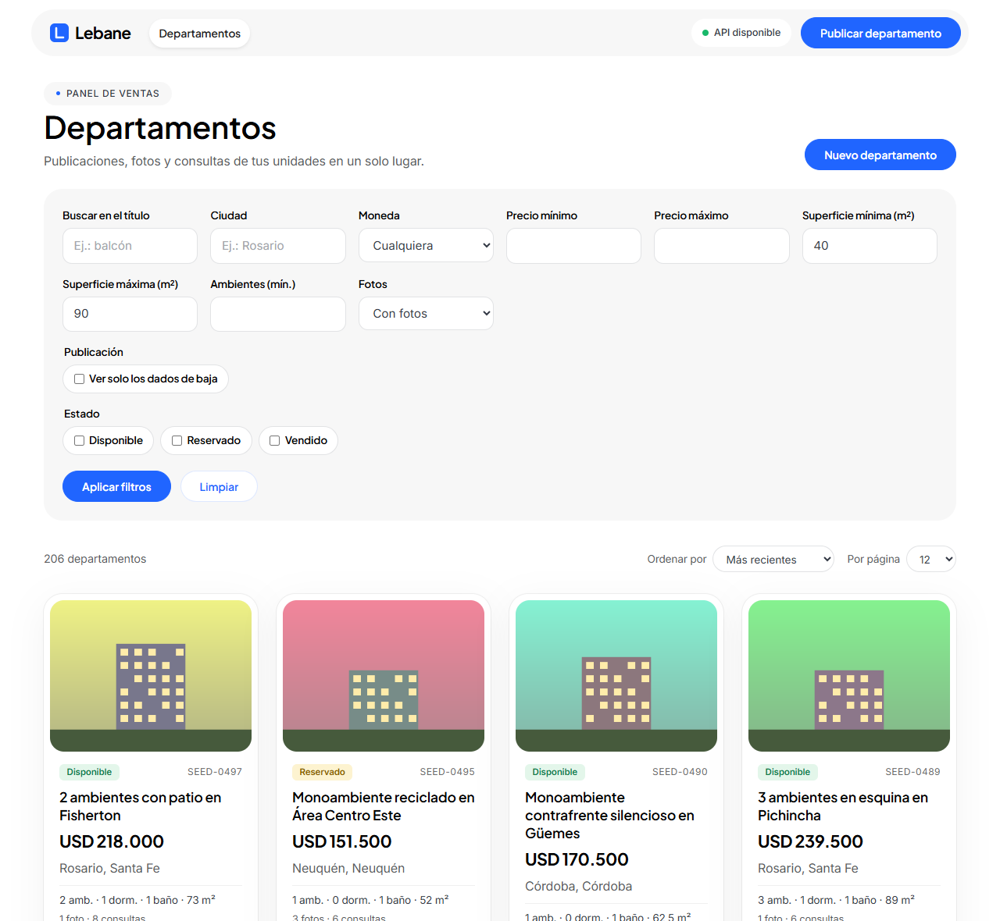
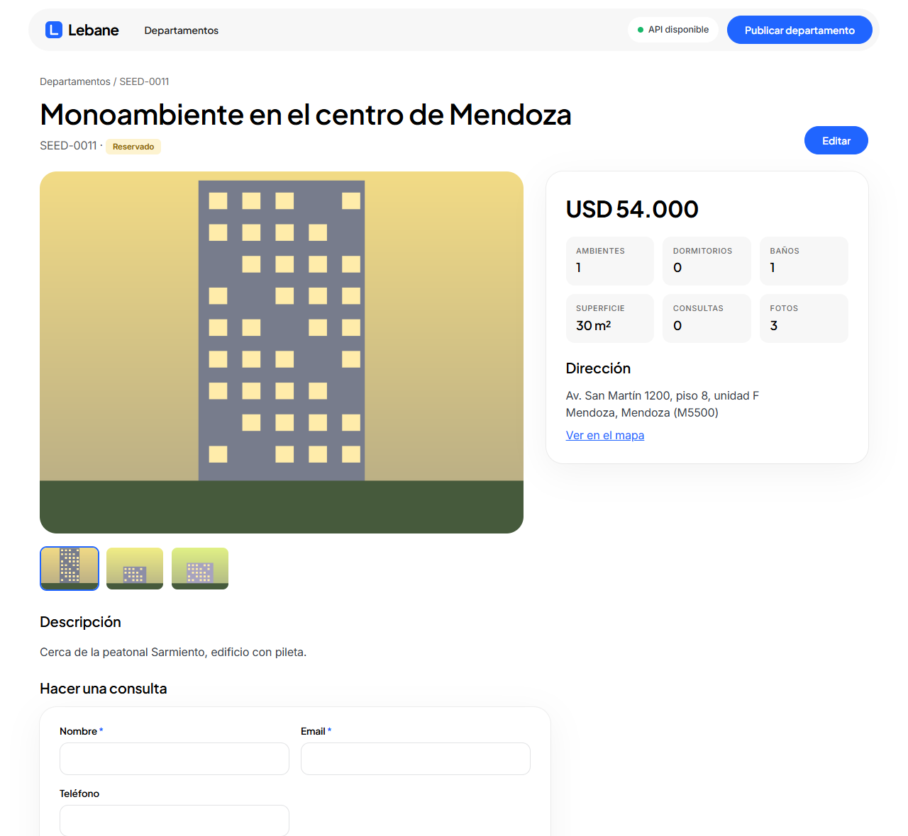
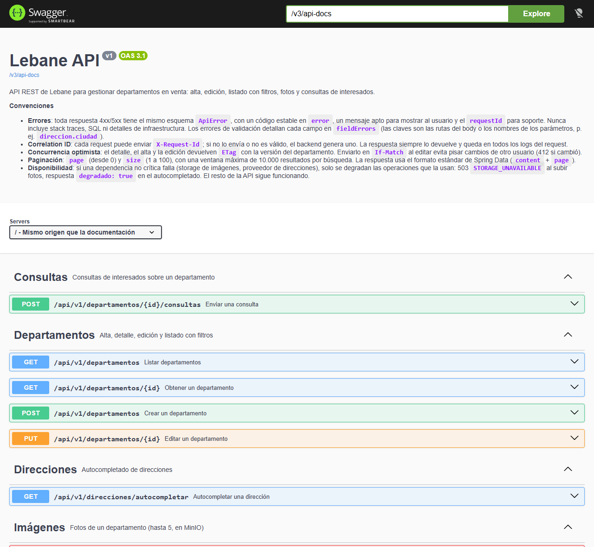
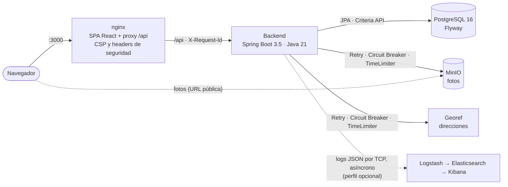

# Lebane

[](https://github.com/mdolce75/lebane/actions/workflows/ci.yml)


Aplicación full stack para gestionar **departamentos en venta**: API REST con Spring Boot, panel en React +
TypeScript, PostgreSQL, fotos en MinIO, autocompletado de direcciones con un proveedor externo y observabilidad
opcional con ELK. Todo se levanta con un solo comando de Docker Compose.

El foco no está en la cantidad de features sino en **cómo se resuelve cada una**: listado sin *full scans*
validado con 100.000 filas, resiliencia probada con caídas reales de las dependencias, contrato OpenAPI que no
puede desactualizarse, y CI con tests de integración y E2E contra el stack completo.



<table>
  <tr>
    <td></td>
    <td></td>
  </tr>
  <tr>
    <td align="center">Detalle con galería y datos</td>
    <td align="center">API documentada con OpenAPI 3.1 (Swagger UI)</td>
  </tr>
</table>

---

## Levantarlo

**Requisitos**: Git y Docker con Compose v2 (Docker Desktop en Windows y macOS), con unos **4 GB de memoria** para
Docker (6 GB o más con el perfil de observabilidad) y los puertos **3000, 8080, 9000, 9001 y 5432** libres (más 9200,
5601 y 5000 con observabilidad).

En bash (Linux, macOS o Git Bash en Windows; en macOS, `sed -i ''`):

```bash
git clone https://github.com/mdolce75/lebane.git && cd lebane
# .env con secretos aleatorios (el mismo método que usa el CI; nunca hay credenciales fijas en el repo)
cp .env.example .env
grep -oE '=change-me[^[:space:]]*' .env | cut -c2- | sort -u | while read -r p; do
  sed -i "s|=$p\$|=$(openssl rand -hex 20)|" .env; done
docker compose up -d --build --wait
```

<details>
<summary>En PowerShell (Windows sin Git Bash)</summary>

```powershell
git clone https://github.com/mdolce75/lebane.git; cd lebane
# .env con secretos aleatorios, guardado sin BOM
Copy-Item .env.example .env
$rng = [System.Security.Cryptography.RandomNumberGenerator]::Create(); $valores = @{}
$lineas = Get-Content .env | ForEach-Object {
  if ($_ -match '=(change-me\S*)$') {
    $p = $Matches[1]
    if (-not $valores.ContainsKey($p)) { $b = New-Object byte[] 20; $rng.GetBytes($b); $valores[$p] = -join ($b | ForEach-Object { $_.ToString('x2') }) }
    $_ -replace ([regex]::Escape($p) + '$'), $valores[$p]
  } else { $_ }
}
[System.IO.File]::WriteAllLines((Join-Path (Get-Location) '.env'), $lineas)
docker compose up -d --build --wait
```

</details>

La primera vez tarda unos minutos más (descarga imágenes y dependencias); después, alrededor de un minuto.

| Qué | Dónde |
|---|---|
| Aplicación (con 12 departamentos de ejemplo) | http://localhost:3000 |
| API documentada (Swagger UI) | http://localhost:8080/swagger-ui.html |
| Health / readiness | http://localhost:8080/actuator/health/readiness |
| Logs en Kibana (opcional) | `LOGSTASH_ENABLED=true` en `.env` y `docker compose --profile observability up -d` → http://localhost:5601 (usuario `elastic`, contraseña `ELASTIC_PASSWORD` del `.env`) |

**Autocompletado de direcciones**: por defecto usa un catálogo de ejemplo sin red (`ADDRESS_PROVIDER=stub`), para que
la app funcione en cualquier máquina sin depender de un servicio externo. Sugiere unas pocas calles, por ejemplo
"Gorriti", "Av. Santa Fe" o "Bv. Oroño". Para buscar cualquier dirección real de Argentina con la API pública
[Georef](https://datosgobar.github.io/georef-ar-api/), sin API key, poner `ADDRESS_PROVIDER=external` en `.env` y
reiniciar el backend con `docker compose up -d --wait backend`. Si Georef no responde, la app sigue funcionando y la
dirección se escribe a mano.

Para bajarlo: `docker compose down` (conserva los datos) o `docker compose down -v` (borra base de datos, fotos y
logs). Para volver a levantarlo alcanza con `docker compose up -d --wait`.

Sin Docker, con variables de entorno, perfil de observabilidad y todas las opciones:
[docs/instalacion.md](docs/instalacion.md).

## Recorrido sugerido (10 minutos)

1. **Usar la app**: filtrar y ordenar el listado (el estado queda en la URL, se puede compartir o recargar),
   crear un departamento con fotos, enviar una consulta.
2. **Probar la concurrencia optimista**: abrir la edición de un departamento en dos pestañas y guardar en
   ambas. La segunda recibe **412** y ofrece recargar, sin pisar los cambios de la primera.
3. **Romper una dependencia**: `docker compose stop minio`. Subir una foto responde 503 con un mensaje claro y,
   después de algunos intentos, el *circuit breaker* rechaza en milisegundos. El listado, el detalle y el
   readiness siguen funcionando. `docker compose start minio` y se recupera solo.
4. **Explorar la API** en Swagger UI: cada endpoint documenta sus errores reales con ejemplos. O correr la
   [colección de Postman](docs/postman/README.md), que recorre todos los endpoints y reglas de negocio con tests.
5. **Leer el código clave**: el [listado con Criteria API](backend/src/main/java/com/lebane/departamento/repository/DepartamentoListadoRepositoryImpl.java),
   la [ejecución resiliente](backend/src/main/java/com/lebane/resilience/ResilientExecutor.java) y el
   [manejo de errores](backend/src/main/java/com/lebane/exception/GlobalExceptionHandler.java).

## Qué resuelve y cómo se comprueba

Cada afirmación tiene un test o una validación reproducible que la respalda.

| | Qué | Evidencia |
|---|---|---|
| **Performance** | Listado paginado con filtros y orden **sin *full scans*** y con **3 consultas fijas por página** (sin N+1), con 100.000 departamentos, 200.000 fotos y 300.000 consultas | [`ListadoPerformanceIT`](backend/src/test/java/com/lebane/departamento/ListadoPerformanceIT.java) verifica con `pg_stat_user_tables` que no haya *seq scans* en 11 escenarios; [`EXPLAIN ANALYZE`](backend/src/test/resources/perf/explain-listado.sql): todas las consultas entre 0,07 y 22 ms |
| **Consultas type-safe** | Todas las consultas (listado, filtros, agregados, reglas de negocio) con **Criteria API y metamodelo**: ninguna escrita como texto ni derivada del nombre del método | [`SinConsultasDeTextoTest`](backend/src/test/java/com/lebane/departamento/repository/SinConsultasDeTextoTest.java) hace fallar el build si aparece una |
| **Resiliencia** | Retry + Circuit Breaker + TimeLimiter para MinIO y el proveedor de direcciones; si fallan, se degrada solo lo que depende de ellos | [`StorageOutageIT`](backend/src/test/java/com/lebane/storage/StorageOutageIT.java) y [`AddressResilienceIT`](backend/src/test/java/com/lebane/address/AddressResilienceIT.java) con caídas reales; validado en vivo ([validación final](docs/calidad.md#validación-final)) |
| **Health probes** | Liveness sin dependencias externas; readiness solo con la base de datos | [`ProbesWithoutDatabaseTest`](backend/src/test/java/com/lebane/actuator/ProbesWithoutDatabaseTest.java) (base caída → liveness 200, readiness 503) y [`NonCriticalDependenciesDownIT`](backend/src/test/java/com/lebane/actuator/NonCriticalDependenciesDownIT.java) (MinIO, Georef y Logstash caídos → todo 200 en < 1 s) |
| **Concurrencia** | Edición con `ETag` / `If-Match`: nadie pisa cambios ajenos | [E2E del conflicto 412](frontend/e2e/departamentos.e2e.ts) en un navegador real contra el stack |
| **Observabilidad** | Logs 100 % JSON con `requestId` y `traceId` de punta a punta (frontend → nginx → backend → proveedor externo); envío a Logstash asíncrono que nunca bloquea | [`TraceCorrelationTest`](backend/src/test/java/com/lebane/logging/TraceCorrelationTest.java), [`LogstashAppenderTest`](backend/src/test/java/com/lebane/logging/LogstashAppenderTest.java) (20.000 eventos sin destino, sin bloquear) |
| **Contrato de la API** | OpenAPI 3.1 generado desde el código y versionado en [`docs/openapi.json`](docs/openapi.json) | [`OpenApiSpecTest`](backend/src/test/java/com/lebane/openapi/OpenApiSpecTest.java) falla si el spec se desactualiza o algo queda sin documentar |
| **Seguridad** | Errores sin detalles internos, Actuator protegido, CSP estricta, sin secretos en Git ni en logs | Auditoría de logs y headers en la [validación final](docs/calidad.md#validación-final); E2E que fallan ante violaciones de CSP |
| **Frontend robusto** | Estado del listado en la URL, respuestas validadas con Zod en runtime, subida de fotos de a una con errores parciales y reintento | [`useListadoSearch`](frontend/src/features/departamentos/listado/useListadoSearch.ts), [`uploadSequentially`](frontend/src/features/departamentos/imagenes/uploadSequentially.ts) y sus tests |

## Arquitectura



- **Backend organizado por dominio** (`departamento`, `address`, `storage`), cada uno con sus capas. Los
  controllers nunca exponen entidades; DTOs con validación declarativa.
- **Dependencias críticas y no críticas**: solo PostgreSQL afecta el readiness. MinIO, Georef y ELK pueden caer
  sin sacar la instancia de servicio.
- Detalle de arquitectura, modelo de datos y decisiones: [docs/arquitectura.md](docs/arquitectura.md) y
  [docs/decisiones.md](docs/decisiones.md).

## Stack

| Capa | Tecnologías |
|---|---|
| Backend | Java 21, Spring Boot 3.5 (Web, Data JPA, Validation, Security, Actuator), Hibernate 6, Flyway, Resilience4j, Micrometer (Prometheus, tracing), springdoc-openapi, Logback + Logstash encoder |
| Datos | PostgreSQL 16 (índices compuestos y trigramas), MinIO (S3) |
| Frontend | React 19, TypeScript, Vite, TanStack Query, React Hook Form, Zod, React Router |
| Tests | JUnit 5, Mockito, Testcontainers, Vitest, Testing Library, Playwright |
| Infraestructura | Docker Compose, nginx, GitHub Actions, Dependabot, ELK (opcional) |

## Calidad

| | Tests | Cobertura de líneas |
|---|---|---|
| Backend | 250 unitarios + 48 de integración (PostgreSQL y MinIO reales con Testcontainers) | 94 % (JaCoCo) |
| Frontend | 105 (Vitest + Testing Library) | 96 % (v8) |
| E2E | 7 escenarios en Chromium contra el stack completo | — |

El **CI** ([GitHub Actions](.github/workflows/ci.yml)) corre todo en cada PR, incluidos los E2E con
`docker compose up`, en unos 7 minutos. Tests, CI y validación final: [docs/calidad.md](docs/calidad.md).

## Documentación

| Documento | Contenido |
|---|---|
| [Instalación y ejecución](docs/instalacion.md) | Requisitos, variables de entorno, Docker Compose, ejecución sin Docker, perfil de observabilidad, seed |
| [Arquitectura](docs/arquitectura.md) | Componentes, modelo de datos, imágenes y MinIO, autocompletado, resiliencia, frontend |
| [API](docs/api.md) | Endpoints con ejemplos, errores, listado (paginación, filtros, orden) y validación de performance |
| [Observabilidad y seguridad](docs/observabilidad.md) | Actuator, liveness y readiness, logging estructurado, correlation ID, datos sensibles |
| [Calidad](docs/calidad.md) | Tests, cobertura, E2E, CI y validación final de punta a punta |
| [Decisiones técnicas](docs/decisiones.md) | Decisiones técnicas con su justificación |
| [OpenAPI](docs/openapi.json) | Contrato de la API (también en Swagger UI) |
| [Colección de Postman](docs/postman/README.md) | Todos los endpoints en orden, con tests (Postman o Newman) |
